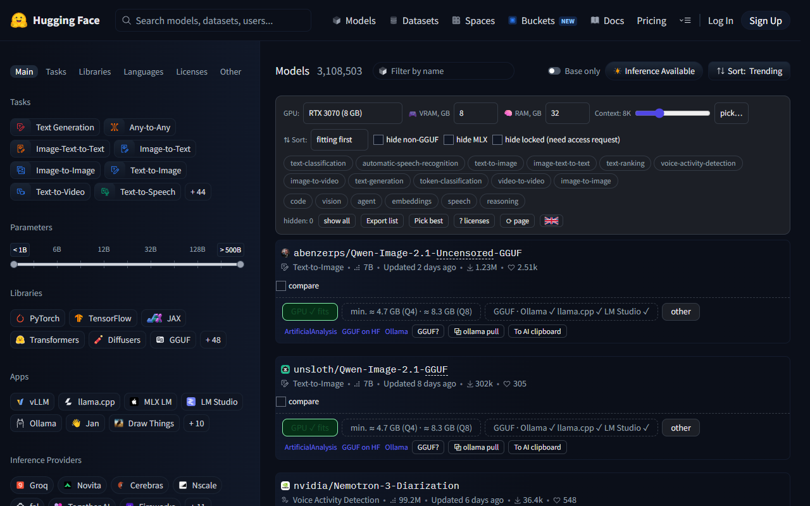
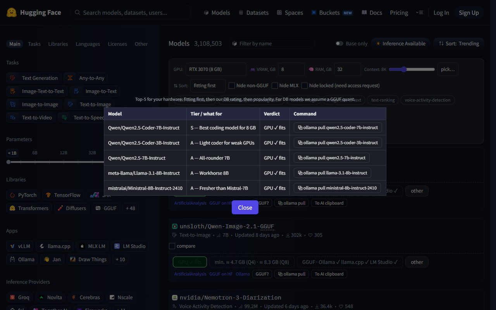
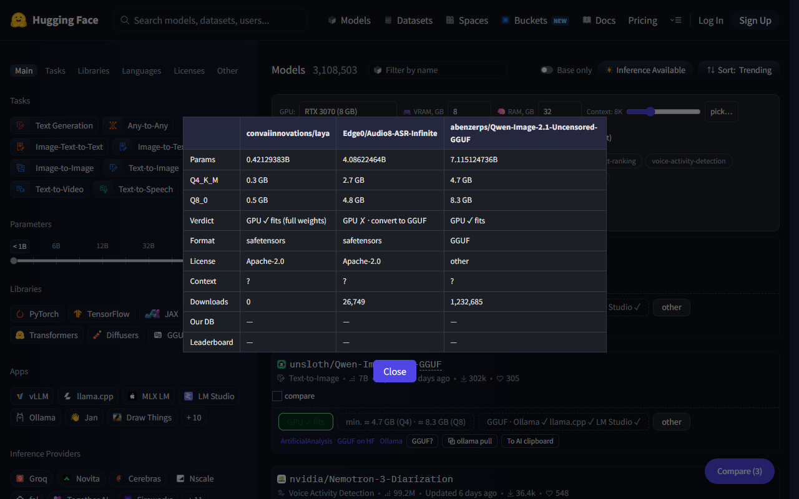
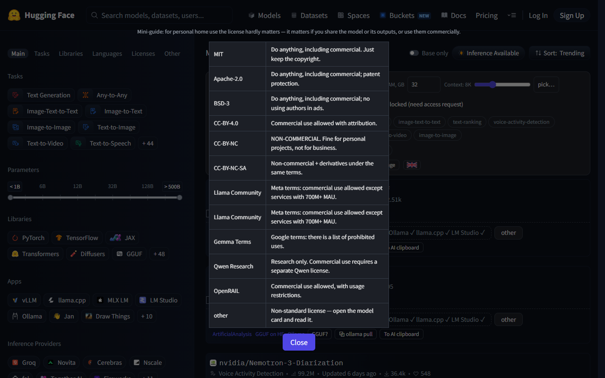
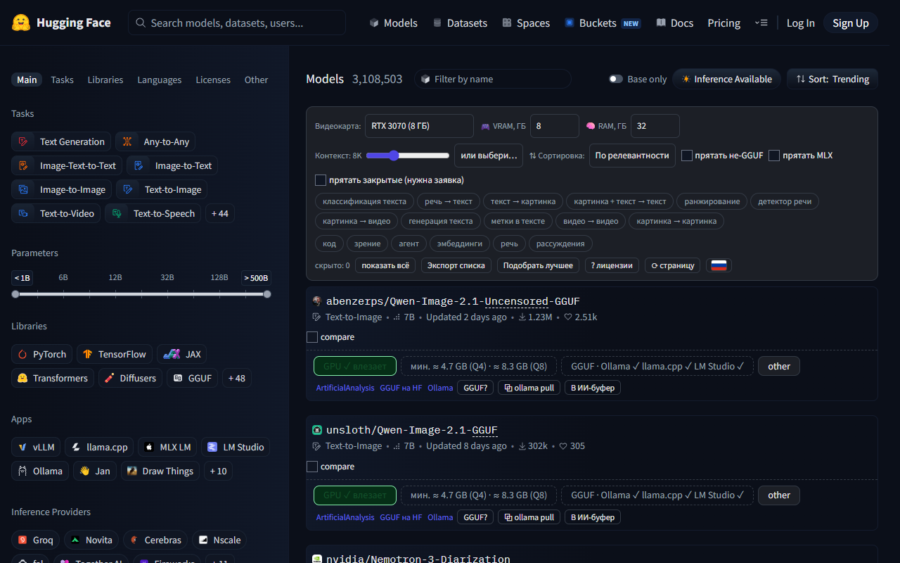

# HF Custom Sort

Tells you whether a Hugging Face model fits **your** GPU — before you download it.

> ⚠️ **Not affiliated with, endorsed by, or sponsored by Hugging Face, Inc.**
> Independent, unofficial browser extension for the public website `huggingface.co`. Product names and trademarks belong to their respective owners.

**[English](#english) · [Русский](#russian)**

<a id="english"></a>
## English

### What it is

Estimates VRAM/RAM requirements for your exact hardware on every model card, marks which models fit, and adds filters, sorting, compatibility badges, a glossary, comparison and a “pick best” picker. English by default, Russian in one click.

### Screenshots

| Panel with fit verdicts | Pick best for your GPU |
|---|---|
|  |  |

| Compare up to 3 models | License mini-guide |
|---|---|
|  |  |

### Features

| Feature | What it does |
|---|---|
| 🟢 Fit verdict | `GPU ✓ fits` / `GPU ✗ · CPU/RAM slow` / `GPU ✗ · convert to GGUF` / `GPU ✗ · does not fit` / `Apple-only` (MLX) / `size unknown` |
| 📐 Transparent math | Tooltip shows `weights + KV cache + system RAM = total of your VRAM` |
| 🎚️ Context slider | 1K–1M (plus 32K…1M presets); longer context eats VRAM as KV cache, verdict recalculated |
| 🎮 Hardware picker | Desktop NVIDIA presets, manual VRAM/RAM fields; math is hardware-agnostic |
| 🔍 Filters | Task chips, purpose chips (code/vision/agent/speech/embeddings/reasoning), hide non-GGUF / MLX / access-gated |
| ↕️ Sorting | Fitting first, by size, by popularity, or the site order; `hidden: N` counter with reset |
| 🏷️ Per-model info | Format (GGUF/MLX/safetensors), runner trio (Ollama ✓ llama.cpp ✓ LM Studio ✓), license explanation, curated rating, Open LLM Leaderboard scores, MoE hint, context size, gated badge |
| 📖 Glossary | Plain-language tooltips for GGUF, MLX, MoE, abliterated, Q4_K_M, safetensors, KV cache and more |
| ⚖️ Comparison | Up to 3 models side by side (10 metrics) |
| 🏆 Pick best | Top-5 for your hardware, with copyable `ollama pull` commands |
| 📋 Export | Visible models as a markdown table; “To AI clipboard” copies a model summary for any AI chat |

### How it works

Quantized model size (Q4_K_M ≈ 4.8 bits per parameter, Q8_0 ≈ 8.5, plus ~10% overhead):

$$\text{VRAM}_{Q4} \approx \text{params} \times \frac{4.8}{8} \times 1.1$$

KV cache grows with context length and is added to the verdict (approximate, fp16):

$$\text{KV} \approx 0.02 \times \text{params}^{0.7} \times \text{context}_{1K}$$

Total requirement checked against your VRAM:

$$\text{Total} = \text{VRAM}_{Q4} + \text{KV} + 1\,\text{GB (system)}$$

Safetensors models are estimated by full fp16 weights (same as Hugging Face does), with the GGUF Q4 alternative shown in the tooltip.

### Install (unpacked)

1. Download `HF-Custom-Sort-1.0.0.zip` from [Releases](../../releases/latest) and unpack it anywhere.
2. Open `chrome://extensions` (or `edge://extensions`) → enable **Developer mode** → **Load unpacked** → select the unpacked folder.
3. Open `huggingface.co/models`. If the tab was already open, reload it (the popup has a reload button).

### Privacy

- No data collection, no telemetry, no analytics.
- Settings are stored locally (`chrome.storage`); nothing leaves your browser.
- Network requests go only to `huggingface.co` (public API and model READMEs/configs), cached locally for 7 days and de-duplicated.
- Permissions: `storage` and `https://huggingface.co/*` only. No remote code, no eval.

### FAQ

<details>
<summary><b>Why does the badge say “does not fit” when I have plenty of VRAM?</b></summary>

The verdict accounts for the KV cache (which grows with context length) and ~1 GB of runtime overhead on top of the weights. Try a smaller context length in the slider — the verdict recalculates instantly.
</details>

<details>
<summary><b>Why is a model marked “GPU ✗ · CPU/RAM slow”?</b></summary>

It does not fit in VRAM, but it fits in system RAM as a GGUF model — it will run, just slowly (typically a few tokens per second).
</details>

<details>
<summary><b>Why does Hugging Face show ✗ while the extension shows ✓ (or vice versa)?</b></summary>

The site estimates raw (full-precision) weights, while the extension estimates the quantized GGUF you would actually download. The tooltip shows both numbers.
</details>

<details>
<summary><b>Does it work on all model pages?</b></summary>

It works on model listing pages (`huggingface.co/models`), including search and filtered views. Dataset and Space pages are not covered.
</details>

### Known limitations

<details>
<summary><b>Approximations you should know about</b></summary>

- Size estimates are approximations: `params × bits/8 × 1.1`; the KV cache coefficient is calibrated against real 7B–70B models.
- Benchmark numbers come from the frozen `open-llm-leaderboard/contents` dataset (submissions from 2024); the snapshot date is in the tooltip.
- The curated model DB is a hand-picked list; refresh it with `node tools/refresh-benchmarks.mjs` (agent-side tool).
- Download counts and licenses come from the public Hugging Face API; missing data is shown as “?” instead of a guess.
</details>

### Development

No build step, no dependencies — plain JavaScript (MV3).

```
lib/core.js   pure calculations: parsing, sizes, verdicts (unit-tested)
lib/api.js    Hugging Face API + cache + request dedup
lib/i18n.js   EN/RU string dictionaries
lib/ui.js     DOM layer: panel, badges, comparison, modals
data/         GPU presets, glossary + licenses, curated model DB
content.js    entry point
```

```bash
node --test                 # 31 unit tests
node tools/refresh-benchmarks.mjs 46
```

### License

MIT — see [LICENSE](LICENSE).

[↑ Back to top](#hf-custom-sort)

<a id="russian"></a>
## Русский

Расширение для `huggingface.co/models`, которое отвечает на вопрос, которого нет у самого сайта: **влезет ли эта модель в вашу видеокарту**. Оно показывает вердикт на каждой карточке, добавляет фильтры, сортировку, бейджи совместимости, глоссарий, сравнение моделей и подбор топ-5 под ваше железо.

Интерфейс по умолчанию английский, русский включается кликом по флагу в панели или в popup.

### Скриншоты



### Возможности

| Возможность | Что делает |
|---|---|
| 🟢 Вердикт | «GPU ✓ влезает» / «GPU ✗ · CPU/RAM медленно» / «GPU ✗ · конвертация в GGUF» / «GPU ✗ · не влезает» / «Apple-only» / «размер неизвестен» |
| 📐 Прозрачная арифметика | В подсказке: «веса + KV-кэш + система = итого из вашей VRAM» |
| 🎚️ Ползунок контекста | 1K–1M (плюс пресеты 32K…1M): длинный контекст ест VRAM как KV-кэш, вердикт пересчитывается |
| 🎮 Выбор видеокарты | Пресеты настольных NVIDIA + ручной ввод VRAM/RAM |
| 🔍 Фильтры | Чипы задач и назначений (код/зрение/агент/речь/эмбеддинги/рассуждения), скрытие не-GGUF, MLX и закрытых моделей |
| ↕️ Сортировка | «По релевантности», по размеру, по популярности или как на сайте; счётчик «скрыто: N» и сброс |
| 🏷️ Данные модели | Формат, совместимость с Ollama/llama.cpp/LM Studio, лицензия с пояснением, оценка мини-БД, оценки лидерборда, подсказка MoE, размер контекста |
| 📖 Глоссарий | Простые объяснения терминов (GGUF, MLX, MoE, abliterated, Q4_K_M, safetensors, KV-кэш и др.) |
| ⚖️ Сравнение | До 3 моделей рядом (10 метрик) |
| 🏆 Подбор лучшего | Топ-5 под ваше железо с готовыми командами `ollama pull` |
| 📋 Экспорт | Таблица видимых моделей в буфер; «В ИИ-буфер» — сводка модели для любого ИИ-чата |

### Как это работает

$$\text{VRAM}_{Q4} \approx \text{params} \times \frac{4.8}{8} \times 1.1$$
$$\text{KV} \approx 0.02 \times \text{params}^{0.7} \times \text{context}_{1K}$$
$$\text{Total} = \text{VRAM}_{Q4} + \text{KV} + 1\,\text{ГБ (система)}$$

Модели в safetensors оцениваются по полным весам (fp16) — так же, как считает сам Hugging Face; в подсказке указан вариант в GGUF Q4.

### Установка (распакованное расширение)

1. Скачайте `HF-Custom-Sort-1.0.0.zip` со страницы [Releases](../../releases/latest) и распакуйте.
2. Откройте `chrome://extensions` (или `edge://extensions`) → включите **Режим разработчика** → **Загрузить распакованное расширение** → выберите папку.
3. Откройте `huggingface.co/models`; если вкладка была открыта раньше — перезагрузите её (в popup есть кнопка).

### Приватность

- Данные не собираются, телеметрии и аналитики нет.
- Настройки хранятся локально (`chrome.storage`).
- Сеть — только к `huggingface.co` (публичный API, кэш 7 дней, без массовых запросов).
- Разрешения: только `storage` и `https://huggingface.co/*`; удалённого кода нет.

### Лицензия

MIT — см. [LICENSE](LICENSE).

[↑ Наверх](#hf-custom-sort)
